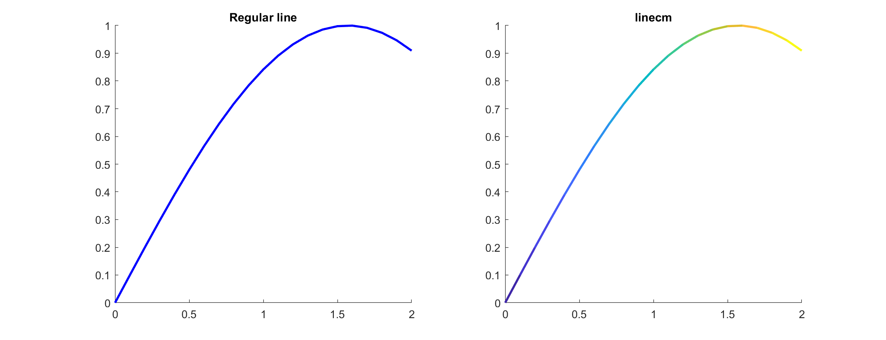

# linecm
[](https://www.mathworks.com/matlabcentral/fileexchange/87794-linecm)

Plot a line with changing color over the course of a line.

To plot a line, run
```matlab
linecm(x, y, @colormap_functionhandle);
```
Just like that! You now have a much better looking line. Here is an example:
```matlab
set(0, 'DefaultLineLineWidth', 2);
x = 0:0.1:2;
y = sin(x);
subplot(1, 2, 1)
line(x, y, 'Color', 'b')
title("Regular line")
subplot(1, 2, 2)
linecm(x, y, @parula); % semicolon is recommended
title("linecm")
```


Clearly, `linecm` looks much better!

## Colormaps
In this file, two additional colormaps have been added: `coolwarm` and `bwr`, inspired by matplotlib. You can read more about them [here](https://matplotlib.org/stable/tutorials/colors/colormaps.html#diverging).
